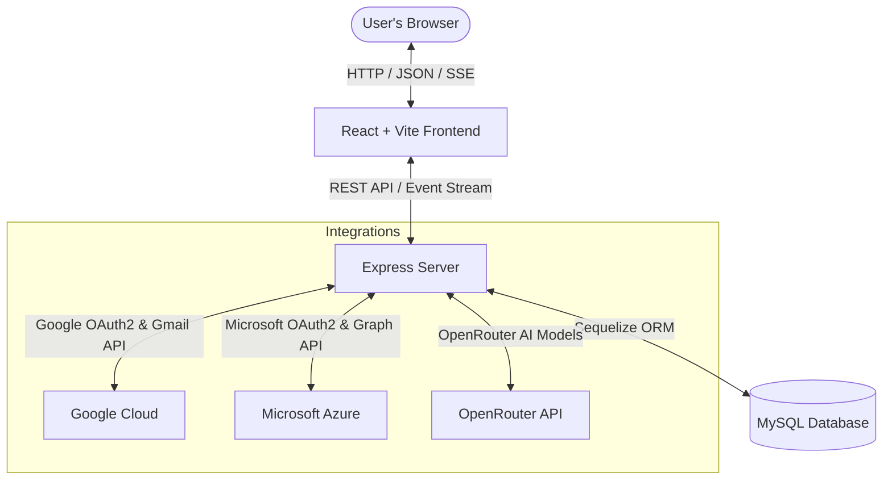

# 📥 InBox_IQ: AI-Powered Unified Smart Inbox

**Tired of constantly switching tabs to check different email accounts?**

**InBox_IQ** brings your Gmail and Microsoft Outlook inboxes together into one clean interface and uses AI to do the heavy lifting for you. Instead of drowning in clutter, InBox_IQ automatically flags what's actually urgent, extracts tasks and calendar invites directly from the email body, drafts quick replies in the tone of your choice, and automatically purges old low-priority emails so your database stays lightweight.

---

## 🏗️ How it Works under the Hood

Here is a quick look at the architecture. The project is split into a **React SPA frontend** (built with Vite and Tailwind CSS) and a **Node.js Express backend** powered by Sequelize ORM (MySQL). Real-time updates are streamed directly to the UI using **Server-Sent Events (SSE)**.



---

## ✨ Key Features

- **🌐 Connect Gmail & Outlook Together**: Link both Google and Microsoft accounts at the same time. The app securely handles token refreshing in the background.
- **🧠 Smart AI Prioritization**: Incoming emails are analyzed and tagged as `URGENT`, `IMPORTANT`, `NORMAL`, or `LOW`. The app also gives you a short, helpful explanation of *why* it decided on that priority.
- **📅 Automatic Task & Event Extraction**: When someone asks for a meeting or gives you a deadline (e.g., *"Let's meet tomorrow at 2 PM"* or *"Please send the report by Friday"*), InBox_IQ automatically extracts it as a task or calendar event.
- **✉️ Quick AI Replies**: Draft responses instantly using customizable tones (**Professional**, **Friendly**, or **Formal**). You can tweak the generated text and send it directly from the dashboard.
- **⚡ Live Updates via SSE**: You don't have to keep refreshing the page. The app uses Server-Sent Events to push new emails, notifications, and task updates straight to your dashboard.
- **⚙️ Custom Override Rules**: Want emails from your boss to always be marked `URGENT`? Or emails with "Newsletter" in the subject to always be `LOW`? You can set up custom matching rules based on sender, domain, or subject keywords.
- **🧹 Auto-Cleanup Retention**: Keep your server storage clean and respect user privacy. The backend has a daemon that automatically deletes old or low-priority emails after a set number of days.

---

## 🛠️ Tech Stack

- **Frontend**: React 19, Vite, Tailwind CSS v3, React Router v7, Axios.
- **Backend**: Node.js, Express.js, Sequelize ORM (MySQL dialect).
- **Security**: JWT sessions, BcryptJS password hashing, AES-256-GCM encryption for storing third-party tokens.
- **APIs**: OpenRouter (defaulting to the `xiaomi/mimo-v2-pro` model), Google APIs, Microsoft Graph.

---

## 📂 Project Structure

```
Unified-Smart-Inbox/
├── backend/
│   ├── config/             # Database connection setup
│   ├── middlewares/        # JWT Authentication & CORS config
│   ├── migrations/         # Database migrations to build tables
│   ├── models/             # Sequelize models (User, Email, Priority, Task, etc.)
│   ├── routes/             # API Endpoints sorted by resource
│   ├── services/           # The brains (OAuth logic, Priority logic, SSE, Cleanup)
│   ├── utils/              # Crypto and env config helpers
│   ├── .envexample         # Template for setting up environment variables
│   ├── package.json        # Backend scripts & packages
│   └── server.js           # Server startup entrypoint
└── frontend/
    ├── public/             # Static public assets
    ├── src/
    │   ├── components/     # UI elements (Sidebar, Navbar, EmailCard, ReplyBox)
    │   ├── config/         # API Base URL helper
    │   ├── context/        # Global React Contexts (Auth, SSE notification streams)
    │   ├── pages/          # Full page views (Dashboard, Tasks Page, Settings)
    │   ├── index.css       # Tailwind setup and custom CSS
    │   └── main.jsx        # App mounting point
    ├── package.json        # Frontend scripts & packages
    └── tailwind.config.js  # Tailwind theme settings
```

---

## 🚀 Getting Started

Getting the app running locally is pretty straightforward. Follow these steps:

### 📋 Prerequisites
- Make sure you have **Node.js** (v18+) and **NPM** installed.
- A local **MySQL** database server running.
- An **OpenRouter API Key** for the AI features.

---

### 1. Database Setup
Log into your MySQL client and run:
```sql
CREATE DATABASE inbox_iq;
```

---

### 2. Setting Up the Backend
1. Go into the backend folder:
   ```bash
   cd backend
   ```
2. Install the packages:
   ```bash
   npm install
   ```
3. Copy the env file template:
   ```bash
   cp .envexample .env
   ```
4. Open the `.env` file and fill in your details:

```ini
# ========== SERVER CONFIG ==========
PORT=8000
FRONTEND_URL=http://localhost:5173
BACKEND_URL=http://localhost:8000

# ========== GOOGLE OAUTH ==========
# Set these up in Google Cloud Console
CLIENT_ID=your_google_client_id
CLIENT_SECRET=your_google_client_secret
REDIRECT_URI=http://localhost:8000/login/oauth2/code/google

# ========== OUTLOOK OAUTH ==========
# Set these up in Microsoft Entra ID (Azure portal)
OUTLOOK_CLIENT_ID=your_outlook_client_id
OUTLOOK_CLIENT_SECRET=your_outlook_client_secret
OUTLOOK_REDIRECT_URI=http://localhost:8000/auth/outlook/callback
OUTLOOK_FETCH_RECENT_DAYS=2

# ========== DATABASE ==========
DB_USERNAME=root
DB_PASSWORD=your_mysql_password
DB_HOST=localhost
DB_PORT=3306
DB_DATABASE=inbox_iq

# ========== JWT & SECURITY ==========
JWT_SECRET=your_jwt_signing_key_here
TOKEN_ENCRYPTION_KEY=32_character_hex_key_for_encrypting_provider_oauth_tokens
JWT_EXPIRES_IN=1h

# ========== EMAIL PRIORITY LLM (OpenRouter) ==========
OPENROUTER_API_KEY=your_openrouter_api_key
OPENROUTER_MODEL=xiaomi/mimo-v2-pro
OPENROUTER_FALLBACK_ON_ERROR=false
PRIORITY_USE_SNIPPET_ONLY=true
```

> [!TIP]
> The `TOKEN_ENCRYPTION_KEY` needs to be exactly 32 characters long. It keeps your connected Google and Microsoft access tokens safely encrypted before they are saved to your database.

---

### 3. Setting Up the Frontend
1. In a new terminal window, go to the frontend folder:
   ```bash
   cd frontend
   ```
2. Install the packages:
   ```bash
   npm install
   ```
3. Open `frontend/src/config/apiConfig.js` and make sure it points to your local backend URL:
   ```javascript
   const API_BASE_URL = import.meta.env.VITE_API_BASE_URL || "http://localhost:8000";
   export default API_BASE_URL;
   ```

---

### 4. Running it Locally

#### 1. Fire up the backend:
From the `backend/` folder:
```bash
node server.js
```
The server will start up, sync all the database tables, and start listening on `http://localhost:8000`.

#### 2. Start the frontend development server:
From the `frontend/` folder:
```bash
npm run dev
```
Open `http://localhost:5173` in your browser. You're ready to register and log in!

---

## 📡 Main API Endpoints

### Auth & User management
- `POST /auth/register` - Create a new account.
- `POST /auth/login` - Log in (stores a secure HttpOnly cookie).
- `POST /auth/logout` - Clear your login session.
- `GET /users/me` - Get current user profile details.

### Emails
- `GET /email/user/:userId` - Get all merged emails (paginated).
- `GET /email/:emailId` - Get a single email's details.
- `GET /email/:emailId/full` - Fetch the full body content.
- `PATCH /email/:emailId/read` - Mark an email as read/unread.
- `DELETE /email/:emailId` - Trash the email on both local DB and remote server.
- `POST /email/send` - Send a reply.
- `POST /email/draft-reply` - Generate an AI draft reply.

### Custom Priority Rules
- `GET /rules` - See all your rules.
- `POST /rules` - Add a rule (by sender, domain, or subject word).
- `DELETE /rules/:id` - Delete a rule.

### Tasks & Calendar Events
- `POST /task/:emailId/auto-create` - Turn email action details into a calendar event or task.
- `GET /task/all` - Get all your active tasks and events.
- `POST /task/manual` - Create a task or event manually.
- `PATCH /task/:id` - Edit a task or mark it complete.
- `DELETE /task/:id` - Remove a task.
